# Healthcare AI — Single-Agent vs Multi-Agent Clinical Reasoning Benchmark

> Benchmarking single-pass and multi-step LLM pipelines on complex clinical reasoning tasks across 8 medical specialties.



---

## What This Project Does

This project evaluates whether decomposing clinical reasoning into specialised agents (Planner → Reasoner → Verifier) produces meaningfully better outputs than a single LLM call — on the same model, same hardware, and a comparable token budget.

Three architectures are compared on 8 hand-crafted clinical cases, each designed with red herrings, safety traps, and at least one life-threatening alternative diagnosis to rule out. Outputs are scored by an LLM-as-Judge on five clinical metrics (0–10 scale), with 3 independent runs per case to reduce variance.

---

## Architectures Compared

### Multi-Agent Pipeline (Planner → Reasoner → Verifier)

```
Clinical Case Input
        │
        ▼
  ┌─────────────┐
  │   Planner   │  Flags red herrings, ambiguous findings, top 3 differentials.
  │  (600 tok)  │  Produces a structured roadmap — no diagnosis yet.
  └──────┬──────┘
         │
         ▼
  ┌─────────────┐
  │  Reasoner   │  Argues FOR / AGAINST each differential step by step.
  │  (900 tok)  │  Concludes with primary diagnosis + confidence %.
  └──────┬──────┘
         │
         ▼
  ┌─────────────┐
  │  Verifier   │  Senior clinician review. Actively hunts for errors,
  │ (1500 tok)  │  drug interactions, missed safety flags.
  └──────┬──────┘
         │
         ▼
  Final Verified Assessment
```

### Single-Agent (Constrained)

One LLM call, 600 tokens. Simulates a realistic deployment under response-time and cost constraints.

### Single-Agent (Unconstrained)

One LLM call, 2300 tokens — budget-matched to the full multi-agent pipeline. Isolates whether the quality gap is due to architectural decomposition or simply a larger token allowance.

---

## Key Results

> Benchmark case: **Paediatric Fever with Petechial Rash — Diagnostic Emergency** (Paediatrics / Emergency)
> Averaged over 3 independent runs. Scored by Amazon Nova Lite (LLM-as-Judge).

### Score Comparison (0–10 scale)

| Metric                  | SA Constrained | Multi-Agent | Δ (MA − SA) |
|-------------------------|:--------------:|:-----------:|:-----------:|
| Diagnostic Accuracy     | 7.67           | 8.67        | **+1.00**   |
| Reasoning Depth         | 6.33           | 8.33        | **+2.00**   |
| Treatment Completeness  | 7.33           | 8.33        | **+1.00**   |
| Safety Awareness        | 5.33           | 7.33        | **+2.00**   |
| Clinical Structure      | 8.00           | 9.00        | **+1.00**   |
| **Overall**             | **7.17**       | **8.17**    | **+1.00**   |

### Ablation — Multi-Agent Sub-Pipelines

| Pipeline Variant         | Overall Score | Latency | LLM Calls | Keyword Coverage |
|--------------------------|:-------------:|:-------:|:---------:|:----------------:|
| Planner Only             | 5.50          | 5.26s   | 1         | 20.0%            |
| Planner + Reasoner       | 7.50          | 12.61s  | 2         | 26.7%            |
| Full Pipeline (+ Verifier)| **9.00**     | 21.87s  | 3         | 33.3%            |

### Efficiency Tradeoffs

| Variant                  | Latency | Tokens Used | LLM Calls |
|--------------------------|:-------:|:-----------:|:---------:|
| Single-Agent (Constrained)   | ~5s  | ~743        | 1         |
| Single-Agent (Unconstrained) | ~9s  | ~1,676      | 1         |
| Multi-Agent (Full Pipeline)  | ~20s | ~5,416      | 3         |

**The multi-agent system is ~4× slower and ~7× more token-intensive than the constrained single-agent, but scores +1.00 higher overall and +2.00 higher on Reasoning Depth.**

---

## Key Findings

**1. Reasoning Depth is the biggest win (+2.00 pts)**
The Planner's explicit red-herring and ambiguity analysis forces the Reasoner to argue FOR and AGAINST each differential rather than defaulting to the most obvious diagnosis.

**2. Safety Awareness improves significantly (+2.00 pts)**
The Verifier's dedicated safety pass catches drug interactions, contraindications, and missed safety flags that single-agent outputs consistently omit. In multi-specialty cases (original 8-case set), this included warfarin reversal, thiamine in the DKA-alcohol patient, anti-D immunoglobulin for Rh-negative ectopic pregnancy, and DOAC interactions.

**3. Architecture matters, not just token budget**
The budget-matched single-agent (2300 tokens, same as full pipeline) underperforms the multi-agent system despite having access to the same total token budget. The decomposed pipeline produces qualitatively better clinical structure.

**4. The Verifier adds the most value per call**
Ablation results show the jump from Planner+Reasoner (7.50) to Full Pipeline (9.00) — a +1.50 gain from one additional agent call — is the largest single-step improvement in the pipeline.

---

## Project Structure

```
.
├── cases.py          # 8 clinical benchmark cases across 8 specialties
├── single_agent.py   # Constrained (600 tok) and Unconstrained (2300 tok) variants
├── multi_agent.py    # Planner → Reasoner → Verifier pipeline + ablation variants
├── evaluator.py      # LLM-as-Judge scoring (5 metrics, 0–10 scale)
├── main.py           # Entry point — runs all variants and saves results
├── utils.py          # Retry logic (exponential backoff), truncation detection
├── results.json      # Raw benchmark output (all runs, all metrics)
├── report.py         # Generates HTML report from results.json
├── report.html       # Pre-generated benchmark report
└── assets/
    └── healthcare_ai_pipeline_flow.svg   # Pipeline architecture diagram
```

---

## Clinical Cases

8 cases across 8 specialties, each designed to stress-test clinical reasoning:

| # | Title | Specialty | Key Traps |
|---|-------|-----------|-----------|
| 1 | Atypical Chest Pain with Confounding History | Cardiology / Emergency | GERD as red herring; bilateral BP asymmetry |
| 2 | Altered Mental Status in Elderly | Internal Medicine / Emergency | Supratherapeutic warfarin; post-antibiotic UTI recurrence |
| 3 | Post-Partum Breathlessness | Obstetrics / Cardiology | Peripartum cardiomyopathy vs PE; TSH distractor |
| 4 | Paediatric Fever with Petechial Rash | Paediatrics / Emergency | Vaccination history as false safety; DIC signs |
| 5 | Transient Focal Neurology (Anticoagulated) | Neurology / Emergency | "Worst headache of life" SAH vs TIA; DOAC on board |
| 6 | Acute Lower Abdominal Pain — Haemodynamic Instability | Gynaecology / Emergency | Denied pregnancy; Rh-negative; ruptured ectopic |
| 7 | Confusion and Vomiting in Known Diabetic | Endocrinology / Emergency | Alcohol + DKA + Wernicke; apparent vs true K+ |
| 8 | Acute Monoarthritis — Immunocompromised | Rheumatology / ID | Septic arthritis on methotrexate; "gout" misdiagnosis |

---

## Quickstart

### Prerequisites

- Python 3.10+
- AWS account with Bedrock access (Amazon Nova Pro + Nova Lite models enabled)
- AWS credentials with `bedrock:InvokeModel` permission

### Install

```bash
git clone https://github.com/your-username/your-repo-name.git
cd your-repo-name
pip install -r requirements.txt
```

### Configure

```bash
cp .env.example .env
# Edit .env and add your AWS credentials
```

```env
AWS_ACCESS_KEY_ID=your_key_here
AWS_SECRET_ACCESS_KEY=your_secret_here
AWS_DEFAULT_REGION=us-east-1
```

### Run

```bash
python main.py
```

Results are saved to `results.json`. Generate the HTML report with:

```bash
python report.py
```

---

## Model & Infrastructure

| Component | Model |
|-----------|-------|
| Reasoning agents (all variants) | `amazon.nova-pro-v1:0` via AWS Bedrock |
| LLM-as-Judge evaluator | `amazon.nova-lite-v1:0` via AWS Bedrock |
| API client | [LiteLLM](https://github.com/BerriAI/litellm) with `bedrock/` prefix |

---

## Design Decisions

A few non-obvious engineering choices documented here for clarity:

**Verifier `max_tokens` raised to 1500**
The original 800-token cap silently truncated the Verifier mid-sentence on complex cases. The Verifier produces the most safety-critical output in the pipeline — silent truncation is unacceptable. The `is_truncated()` utility in `utils.py` now flags any output that doesn't end with a sentence terminator.

**Warm-up ping before single-agent calls**
AWS Bedrock has a cold-start latency penalty on the first call. The multi-agent system's Planner naturally warms the endpoint for subsequent agents. Without an explicit warm-up ping, single-agent variants unfairly absorbed this cold-start cost, inflating their measured latency. Both single-agent variants now fire a `max_tokens=1` ping before the timed block.

**`utils.py` DRY refactor**
`call_with_retry` was copy-pasted identically across three files in the original codebase. Extracted to `utils.py`. The retry pattern list was also expanded to cover `424 Failed Dependency` (Bedrock upstream fault) and `APIConnectionError` (class name match, not message match) which caused a hard crash at Case 6 Run 3 in the original.

---

## Limitations

- Benchmark currently covers 1 case (Case 4) in `results.json` — full 8-case run requires sufficient AWS Bedrock quota.
- LLM-as-Judge scoring introduces its own model bias; scores should be interpreted relatively, not as absolute clinical ground truth.
- All three variants use the same base model. Results may differ on other LLMs.
- This is a research benchmark. **Not a medical device. Not validated for clinical use.**

---

## License

MIT License — see [LICENSE](LICENSE) for details.
